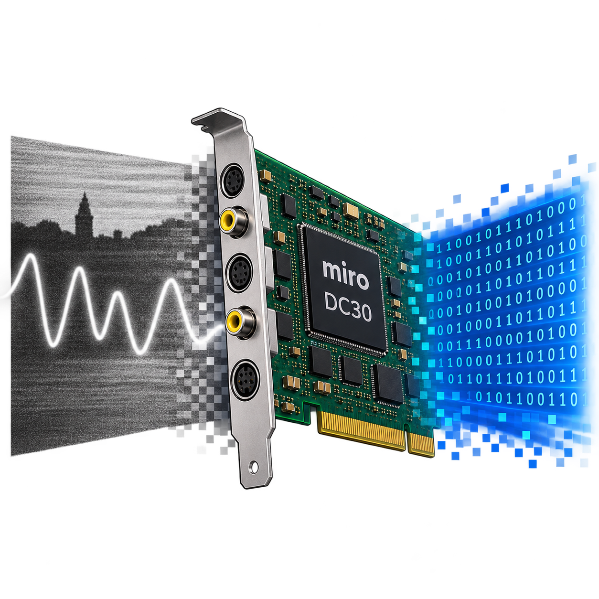

# dc30-linux

A new Linux driver (V4L2 + ALSA, out-of-tree DKMS kernel modules) for the
**miro DC30** and **DC30 plus** PCI video capture cards, together with the
recording application **dc30-capture**.

The main goal is **audio recorded in step with the video**, above all for
digitizing old VHS and S-VHS tapes. The historical open-source `zoran`
driver never supported the DC30's audio. The original Windows driver no
longer runs on current PCs and was not reliable with poor input signals.
This driver is written from scratch with audio/video sync as a core part of
its design.

<div style="clear: both;"></div>

## Status

**Version 1.0.0.** The driver and the application are in daily use for
digitizing tapes. Tested with PAL from a VCR on S-Video, on a board of
revision 601694-6.0 behind a PCIe-to-PCI bridge. Recordings of more than an
hour run without gaps and with the sound in sync at the end.

NTSC and SECAM can be selected, but are untested. Video output is not
supported (see [Roadmap](#roadmap)).

## Features

**Driver**

- **Raw video:** YUYV 768×576 (PAL), interlaced, a steady 25 fps. Field
  jumps of a poor source are detected and no field is lost.
- **MJPEG:** real-time compression by the card's JPEG codec (ZR36050 +
  ZR36016), set by data rate (1000–6300 kB/s). Every field is a complete
  JPEG with its own tables. The driver pairs the fields by parity, even when
  the codec gets them wrong after a field jump.
- **Audio:** ALSA card `DC30`, 16-bit stereo. By default the sample clock
  is **locked to the video line frequency in hardware**, exactly 1764
  samples per PAL frame. A crystal mode offers 8–48 kHz.
- **A/V metadata:** a second V4L2 node delivers, for every frame, the
  timestamps of both fields and the exact position of each field in the
  audio stream, plus error counters. An application can always tell which
  audio belongs to which frame, even across lost frames.
- **Power management:** the card sleeps whenever nobody uses it. The chips
  are powered down individually.
- **Self-tuning bus timing:** the driver finds the best PostOffice timing
  for the PCI bridge it sits behind.

**dc30-capture** (Qt 6)

- Live preview, level meters with clip indicator, mixer, monitoring
  through the card or lip-synchronously through the PC's sound output.
- Records Matroska files on the card's time base: **FFV1** (lossless,
  compressed on the PC, so it needs a fair share of CPU) or the card's
  **MJPEG** (compressed on the card and passed through untouched, light on
  the CPU, a good choice for older PCs), with PCM audio. Missing frames are
  repeated and logged.
- **Field order from the picture:** the decoder's field flag is unreliable
  on a VCR without time base corrector, and whole scenes can come out with
  swapped fields. dc30-capture determines each field's position from the
  picture itself and pairs the fields accordingly. `dc30-capture --fix`
  repairs finished recordings.
- Unattended recording from the command line.
- English and German user interface.

## How it works

The card combines a Zoran ZR36057 PCI controller, a Micronas VPX3220A video
decoder, a Zoran ZR36050/ZR36016 JPEG codec, an Analog Devices AD1843 audio
codec behind a small audio ASIC, and an ADV7176 video encoder. Its audio
has no DMA path: every sample byte is read by the CPU through a register
window.

- [docs/hardware.md](docs/hardware.md): the chips, what each one does and
  how they are wired, including what is not in any datasheet.
- [docs/driver.md](docs/driver.md): how the driver drives them: video, MJPEG,
  audio, A/V sync, power management, PCI timing.
- [docs/module-parameters.md](docs/module-parameters.md): every module
  parameter explained.

## Requirements

- A miro DC30 or DC30 plus in a PCI slot. A PCIe-to-PCI bridge (on the
  board or as an adapter card) works.
- Linux with kernel headers and DKMS. The packages are built for
  **Ubuntu 24.04 / Linux Mint 22** (amd64). On other distributions, build
  from source.
- For dc30-capture: Qt 6, ALSA and FFmpeg libraries.

## Installation

### From the release packages

Download both `.deb` files from the
[latest release](https://github.com/bytewarrior/dc30-linux/releases/latest) and
install them:

```sh
sudo apt install ./dc30-dkms_1.0.0_all.deb ./dc30-capture_1.0.0_amd64.deb
```

`dc30-dkms` installs the driver sources, and DKMS builds the modules for
every installed kernel, also after kernel updates. With Secure Boot, DKMS
signs the modules with the machine owner key (MOK). If no key is enrolled
yet, Ubuntu asks you to enroll one at the next boot.

Then load the driver, or reboot:

```sh
sudo modprobe dc30
```

### From source

Driver (needs the kernel headers and `dkms`):

```sh
sudo mkdir -p /usr/src/dc30-1.0.0
sudo cp src/*.c src/*.h src/Makefile src/dkms.conf /usr/src/dc30-1.0.0/
sudo dkms install dc30/1.0.0
sudo modprobe dc30        # also loads dc30_vpx3220
```

dc30-capture (packages on Ubuntu 24.04: `cmake`, `qt6-base-dev`,
`qt6-tools-dev`, `qt6-l10n-tools`, `libasound2-dev`, `libavcodec-dev`,
`libavformat-dev`, `libswresample-dev`):

```sh
cmake -S app -B app/build -DCMAKE_BUILD_TYPE=Release
cmake --build app/build
sudo cmake --install app/build
```

`dc30-metadump`: `make -C tools`.

The Debian packages themselves are built by `packaging/build-debs.sh 1.0.0`
(needs `dpkg-dev` and [nfpm](https://nfpm.goreleaser.com)).

## Usage

**dc30-capture:** start it from the desktop menu ("DC30 Capture"), choose
the input, the codec and the target folder, and record. Without a window:

```sh
dc30-capture --record 3600 --dir ~/Videos --codec ffv1     # one hour, FFV1
dc30-capture --record 600 --codec mjpeg --rate 6000        # MJPEG at 6000 kB/s
dc30-capture --fix recording.mkv                           # re-pair fields by the picture
```

For damaged tapes, use FFV1. On rare disturbances of the field timing, the
hardware codec drops three frames, while the raw path loses nothing.

**Other applications:** the video node is the one named `dc30`
(`v4l2-ctl --list-devices`). Audio is `hw:DC30`:

```sh
v4l2-ctl -d /dev/videoN --set-input=1                # S-Video
arecord -D hw:DC30 -f S16_LE -c 2 -r 44100 audio.wav
```

The audio clock follows the selected video input. Set the input even for an
audio-only recording.

In the ALSA mixer, capture source "External" is the card's external audio
jack and "Internal" the internal audio connector.

**Troubleshooting**

- Audio xruns or a high CPU load of the `dc30` drain thread: see
  [PCI timing](docs/module-parameters.md#pci-timing).
- `rmmod dc30` fails because the device is in use: PipeWire/WirePlumber
  keeps the control device of every sound card open. A WirePlumber rule can
  keep it off the DC30. dc30-capture, `arecord -D hw:DC30` and other
  applications that use ALSA directly keep working. The card just no longer
  shows up in the desktop's sound settings.

  WirePlumber 0.4 (Ubuntu 24.04, Linux Mint 22; check with
  `wireplumber --version`), file
  `~/.config/wireplumber/main.lua.d/51-dc30-disable.lua`:

  ```lua
  rule = {
    matches = {
      { { "api.alsa.card.id", "equals", "DC30" } },
      { { "api.alsa.card.name", "equals", "miro DC30" } },
    },
    apply_properties = {
      ["device.disabled"] = true,
    },
  }

  table.insert(alsa_monitor.rules, rule)
  ```

  WirePlumber 0.5 and later, file
  `~/.config/wireplumber/wireplumber.conf.d/51-dc30-disable.conf`:

  ```
  monitor.alsa.rules = [
    {
      matches = [
        { api.alsa.card.id = "DC30" }
        { api.alsa.card.name = "miro DC30" }
      ]
      actions = {
        update-props = {
          device.disabled = true
        }
      }
    }
  ]
  ```

  Then `systemctl --user restart wireplumber`.
- Statistics and diagnosis: `/sys/kernel/debug/dc30/<PCI address>/`, see
  [docs/driver.md](docs/driver.md#debugfs).

## Roadmap

- Video output and playback, including MJPEG decompression
- Audio video lock for NTSC, and NTSC testing in general
- Optional loop-through of the input to the card's video outputs
- A "no signal" warning that does not disturb a running capture

## Contributing

Bug reports and pull requests are welcome. Reports from other boards,
PCI bridges and NTSC sources are especially useful. Please include the
output of `dmesg | grep -i dc30` and, for capture problems, the debugfs
`stats` and `audio_stats` files.

## Acknowledgements

This driver stands on the shoulders of others.

- **The GPL `zoran` driver** for the Zoran ZR36057/ZR36067 cards, by Dave
  Perks, Rainer Johanni, Wolfgang Scherr, Serguei Miridonov, Ronald Bultje,
  Laurent Pinchart, Maxim Yevtyushkin and the mjpeg-users community.
  `dc30_vpx3220` is a port of its VPX3220 driver by **Laurent Pinchart**.
  The video front end set-up, the reset sequence and the I2C bus are based
  on `zoran_device.c` and `zoran_card.c`. Its DC30 card table confirmed the
  board's GPIO and input wiring. Without this driver, the DC30 would have
  been a much harder start.
- **The Linux kernel's `tea6415c` driver**, for the byte format of the
  video crosspoint switch.
- **The chip datasheets** of Zoran (ZR36057, ZR36050, ZR36016), Micronas
  (VPX3220A), Analog Devices (AD1843, ADV7176) and ST (TEA6415C).
- **The JPEG standard** (ITU-T T.81, Annex K) for the quantization and
  Huffman tables.
- **Qt, FFmpeg and ALSA**, on which dc30-capture is built, and
  [nfpm](https://nfpm.goreleaser.com) for the packages.

## Disclaimer

This project is not affiliated with, endorsed by or connected to miro,
Pinnacle Systems, Zoran, Micronas, Analog Devices, STMicroelectronics or
any of their successors. All product names and trademarks belong to their
owners and are used only to describe compatibility. Parts of the hardware
behaviour were worked out by observing the original Windows driver, for the
sole purpose of interoperability. Use this software at your own risk.

## License

GPL-2.0-only, see [LICENSE](LICENSE). The header
[`src/dc30_meta.h`](src/dc30_meta.h), which applications include, is
GPL-2.0-only WITH Linux-syscall-note.

## Part of the save old hardware collection


This project is part of a larger idea: I own a lot of old hardware that would be unusable if I hadn't written drivers and tools to bring it back to life. From the early nineties and, even more so, the early 2000s up to today, a lot of Windows-only or use-once-then-throw-away hardware was developed and sold, only to become electronic waste a few years later. And it kept happening, because the manufacturers kept moving on to newer products and dropping support for older devices entirely. Expensive audio equipment, lab gear, other specialized kit that's hard to find, you name it.

As a tinkerer, electrical design engineer and software developer (I do the latter two for a living), I decided to stop accepting this and do something about it. Hence, I've created this logo, and I attach it to every project where saving a device from becoming waste is a central goal.

Feel free to use this logo as well, and spread the word! Thanks for reading this. People like you make a difference in this world. Become a part of us — try to write software for the stuff you own, and consider publishing it as open source.

<div style="clear: both;"></div>
