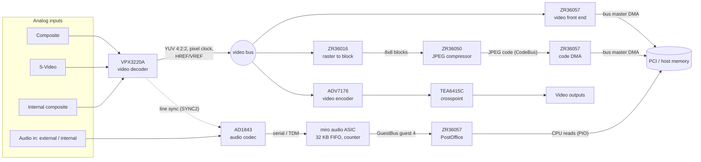

# The miro DC30 hardware

This document describes the miro DC30 as far as the driver needs it: which
chips are on the board, what each one does, and how they are wired
together. Much of it is not in any public datasheet. It was worked out from
the datasheets of the individual chips, the historical GPL `zoran` driver,
the register accesses of the original Windows driver (`dc30.sys`) and
measurements on a real card. Where something is an inference rather than a
measured fact, it says so.

The DC30 and the DC30 plus are the same board. The "plus" adds an external
connector box and more bundled software.

Tested board revision: **601694-6.0**, PCI ID `11de:6057` (Zoran ZR36057).

## Chips at a glance

| Chip | Function | Reached through |
| ---- | -------- | --------------- |
| Zoran **ZR36057** | PCI bridge and bus master: video front end with DMA, JPEG code DMA, GuestBus, I2C, GPIOs, interrupts | PCI, one 4 KB MMIO BAR |
| Micronas (ITT) **VPX3220A** | Video decoder: Composite/S-Video to digital YUV 4:2:2, sync signals, pixel clock | I2C, address `0x47` |
| Zoran **ZR36016** | Raster-to-block converter for the JPEG codec, with an external strip buffer (three SRAMs) | GuestBus guest 2 |
| Zoran **ZR36050** | JPEG image compression processor | GuestBus guests 0 and 1 (address latch) |
| Analog Devices **AD1843** | 16-bit stereo audio codec ("SoundComm") with programmable clock generators | serial (TDM) link to the audio ASIC |
| miro audio ASIC | Bridges the AD1843's serial port to the GuestBus; sample FIFO and sample counter | GuestBus guest 4 |
| Analog Devices **ADV7176** | Video encoder: digital YUV to Composite/S-Video for the video outputs | I2C, address `0x2A` |
| ST **TEA6415C** | 8×6 video crosspoint switch | I2C, address `0x03` |
| 74LS374 | Octal latch: holds the upper address bits of the ZR36050 | written as guest 1 |

The audio ASIC carries a miro marking (FST97A1 on the tested board). Its
function is known only from how `dc30.sys` uses it.

## How the chips work together

### Video capture, raw

The VPX3220A digitizes the selected input and drives the board's video bus
with 16-bit YUV 4:2:2 data, a 13.5 MHz pixel clock and the sync signals. On
this board it outputs a fixed square-pixel picture per standard: 768×576 for
PAL, 640×480 for NTSC. The ZR36057's video front end (VFE) takes the data
from the bus and writes it by bus-master DMA into host memory, one field at
a time. A field interrupt (the ZR36057's GIRQ1) marks each vertical sync.

GPIO3 of the ZR36057 sets the direction of the video bus. It must be 1
(decoder towards ZR36057) for capture. With it at 0, captured video shows a
fine diagonal moiré pattern.

### Video capture, MJPEG

For compressed capture the same video bus also feeds the ZR36016. It cuts
each field into 8×8 blocks (in a strip buffer made of three external SRAMs)
and hands them to the ZR36050. The ZR36050 encodes each field as one
baseline JPEG and sends the code over the CodeBus to the ZR36057, which
writes it by DMA into a ring of code buffers in host memory. A finished
frame holds two complete JPEG images, one per field.

Both codec chips run on the decoder's pixel clock. Without the decoder's
outputs enabled the ZR36050 does not answer at all.

The ZR36050 has bit rate control: after every field it computes a new scale
factor so that the next field meets the target code volume. The real setting
is therefore the data rate, not a quality value. The picture quality follows
from the picture content.

### Audio

The board has **no audio DMA**. The ZR36057 has exactly two DMA engines
(video front end and JPEG code), and the audio path uses neither. Instead:

- The AD1843 codec talks to the miro audio ASIC over its serial (TDM) port.
- The ASIC collects the samples in a 32 KB ring. At 44.1 kHz stereo that is
  about 186 ms.
- The host reads the samples **byte by byte** through the ZR36057's
  PostOffice, a slow, CPU-driven register window onto the GuestBus. A read
  of guest 4 register 0 returns the next FIFO byte.
- The stream starts with one dummy byte, then 16-bit samples, high byte
  first, left and right alternating.
- Guest 4 registers 5 and 6 form a free-running hardware counter of the
  bytes the ASIC has taken in. It is the reference clock for both the drain
  and the audio/video alignment.
- AD1843 registers are reached indirectly through guest 4 registers 2–4.
  Register 2 holds the index plus "busy" and "read" flags, registers 3 and 4
  hold the data.

After reset the AD1843 runs a 32-slot TDM frame. The ASIC only reads the
answer slots of a 16-slot frame, so every register read returns register 0
until the frame size is switched (register 26, FRS) as the very first
write.

### Audio/video lock

The AD1843 has clock generators that can lock the sample clock to a video
line frequency instead of a crystal. The DC30 wires two sync signals to it:

- **SYNC1** is VACT of the VPX3220A. It has a gap of several lines per
  field. A clock generator locked to it runs about 0.2–0.4 % fast,
  depending on the decoder's window.
- **SYNC2** follows the line frequency of the selected decoder input
  exactly. This is what `dc30.sys` uses for capture.

Locked to SYNC2 (clock generator 2, converters on generator 2), the codec
produces exactly **1764 samples per PAL frame** at 44.1 kHz. That is
44100 / 25, and it holds over hours. Audio and video then run in lockstep in
hardware, with no drift to correct. The lock follows the **decoder input
that is currently selected**. Even an audio-only capture therefore needs the
right video input set. Without a video signal the decoder runs free, and
the audio follows its free-running line rate.

In crystal mode the AD1843 runs at any rate from 8 to 48 kHz, but not in
step with the video.

### Video output

The ADV7176 encoder and the TEA6415C crosspoint drive the card's video
outputs (playback, and loop-through of the input). The driver does not
support video output yet. It keeps the encoder powered down and never
writes the crosspoint. From the values `dc30.sys` writes, the crosspoint
most likely routes either the encoder or the selected input to the output
connectors. This is not verified on the board.

## ZR36057 GuestBus map

The ZR36057 reaches up to eight external "guests" through its PostOffice
register (`0x200`): one byte per access, with a busy flag (POPen, bit 25)
and a timeout flag (POTime, bit 24).

| Guest | Device | Registers |
| ----- | ------ | --------- |
| 0 | ZR36050 data | register = address & 3 |
| 1 | ZR36050 address latch (74LS374) | register 0 = address >> 2 |
| 2 | ZR36016 | 0 GO/STOP, 1 mode, 2 index, 3 indirect data |
| 4 | Audio ASIC | 0 sample FIFO, 1 control, 2–4 AD1843 access, 5/6 sample counter |
| 5 | unknown | read once by `dc30.sys` during audio init |
| 7 | Field indicator | register 0: bit 0 = field (0 = top), bits 1–2 = vsync pulse (~130 µs) |

GuestBus timing (GCR2, `0x12C`): `0xF5`, i.e. guest 4 at 4/4 PCI clocks and
guests 5–7 at 15/15. Bit 7 of guest 4 register 1 is read-only and
identifies the board variant. On boards that have it set (the tested one
does), `dc30.sys` widens guest 4's write timing for each write.

The ZR36057 datasheet asks for JPEG processing (Go_en) to be paused around
each PostOffice access while the codec runs. `dc30.sys` does this for every
guest, audio included.

## GPIOs (ZR36057 GPPGCR1, bits 31:24)

| GPIO | Function |
| ---- | -------- |
| 1 | ZR36050 reset, active low |
| 2 | ZR36050 clock enable ("JPEG sleep"), 1 = running |
| 3 | Video bus direction, 1 = decoder → ZR36057 (capture) |
| 4, 5 | Clock select (capture: GPIO4 = 0, GPIO5 = 1) |
| 7 | Video bus sync enable, active low |

## I2C devices

The ZR36057 bit-bangs an I2C bus through its I2CBR register (SDA = bit 1,
SCL = bit 0).

| Address (7-bit) | Device | Notes |
| --------------- | ------ | ----- |
| `0x03` | TEA6415C crosspoint | write-only, one byte per connection, no register address. Only `i2cdetect -a` finds it |
| `0x2A` | ADV7176 encoder | `dc30.sys` also tries `0x2B` |
| `0x47` | VPX3220A decoder | alternate address strap. `dc30.sys` also knows a VPX3225 |

The VPX3220A has a second, larger register space ("FP" registers), reached
indirectly through I2C registers `0x26`–`0x29`.

## Video inputs

| Input | Decoder input |
| ----- | ------------- |
| Composite | VIN2 |
| S-Video | VIN1 (luma) + chroma |
| Internal | VIN3 (composite, internal connector) |

## Field identity

The ZR36057 has no readable field parity. There are two sources:

- **The decoder's field flag**, which the VPX3220A puts on the video bus and
  which guest 7 reports. It has two modes. "Toggle every field" (as
  `dc30.sys` uses it) misses a field jump in the input, for example at a cut
  on an edited tape. Whole sections then come out with swapped fields.
  "Follow the input" catches jumps but misreads single fields on some VCR
  signals. Neither mode is reliable on a VCR without time base corrector.
- **The picture itself.** Consecutive fields are offset by half a line, and
  the direction of that offset tells the parity whatever the motion.
  `dc30-capture` uses this (see [driver.md](driver.md)).

## PCI

The ZR36057 is a 33 MHz PCI 2.1 device with no PCI power management
capability. On current PCs it usually sits behind a PCIe-to-PCI bridge.
Each non-posted read through such a bridge is a full round trip, measured
at about 2.3 µs. That matters for everything that polls through the
PostOffice, above all the audio drain. See [driver.md](driver.md#pci-bus-timing)
for what the driver does about it.

## Power

Typical currents from the datasheets (5 V):

| Chip | Running | Saving |
| ---- | ------- | ------ |
| ZR36050 | 320 mA, **also in reset** | 5 mA stand-by, clock off |
| ADV7176 | ~250 mA | DACs off + "lower power" mode |
| AD1843 | ~200 mA | converters, clock generators and outputs off |
| VPX3220A | ~180 mA + output drivers | ADCs in stand-by, outputs high-impedance |
| ZR36016 | 220 mA | no stand-by mode |
| ZR36057 | up to 1.6 W under bus-master load | soft reset |

Measured at the wall socket, the difference between all-on and all-off was
much smaller than these figures suggest. During a capture, the PC's own
load (audio drain, compression) weighs more than the card.
